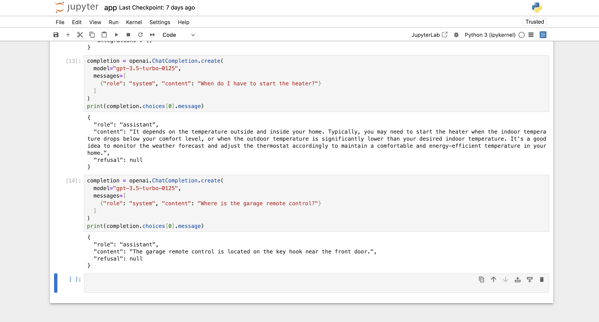

# Fine-Tuning a Model Using OpenAI API

This repository demonstrates the process of fine-tuning an OpenAI model using a JSONL dataset. The workflow involves data preparation, fine-tuning, and testing the fine-tuned model with sample queries.

---

## Introduction

This project explores the fine-tuning capabilities of OpenAI's GPT models to customize the behavior of AI models for specific tasks. The training data consists of prompt-completion pairs in a JSONL format.

The fine-tuned model is used to answer specific queries based on training data.

---

## Features

- Fine-tune OpenAI's GPT models with custom datasets.
- Monitor the status of fine-tuning jobs in real-time.
- Test the fine-tuned model for specific queries.
- Hyperparameter customization for better performance.

---

## Prerequisites

- Python 3.8 or higher.
- An OpenAI API key.
- Required Python packages:
  - `openai`
  - `dotenv`
  - `pandas`
  - `numpy`

---

## Setup

1. Clone this repository.
```bash
   git clone https://github.com/JTasnim/Fine_Tuning_JSONL_FILE.git
   openai tools fine_tunes.prepare_data -f data.jsonl
   openai api fine_tunes.create -t data_prepared.jsonl -m gpt-3.5-turbo
   openai api fine_tunes.follow -i <job_id>
   openai api fine_tunes.list

```

## Screenshot of execution results



   
